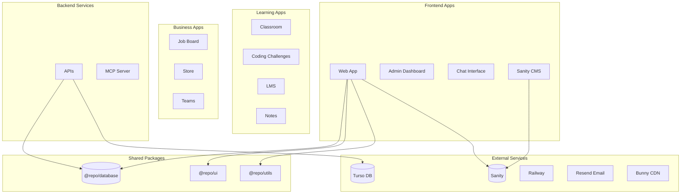

# Architecture

System architecture and component relationships for TekBreed Platform.

## High-Level Architecture



## Technology Stack

| Layer | Technology |
|-------|------------|
| **Frontend** | React 19, React Router v7, Tailwind CSS v4 |
| **Backend** | Node.js, React Router SSR |
| **Database** | Turso (SQLite), Prisma ORM |
| **CMS** | Sanity.io |
| **Auth** | Session-based, GitHub OAuth |
| **Email** | Resend |
| **Storage** | Bunny CDN |
| **Payments** | Polar |
| **Hosting** | Railway |

## Monorepo Structure

```
platform/
├── apps/                    # Applications
│   ├── web/                 # Main web app (React Router v7)
│   ├── cms/                 # Sanity Studio
│   ├── admin/               # Admin dashboard
│   ├── chat/                # AI chat interface
│   ├── classroom/           # Classroom app
│   ├── coding-challenges/   # Code challenges
│   ├── docs/                # Documentation site
│   ├── job-board/           # Job listings
│   ├── lms/                 # Learning management
│   ├── mcp/                 # MCP server
│   ├── notes/               # Notes app
│   ├── store/               # E-commerce
│   ├── teams/               # Team management
│   └── apis/                # API services
├── packages/                # Shared packages
│   ├── database/            # Prisma + Turso
│   ├── ui/                  # React components
│   ├── utils/               # Utilities
│   ├── base-config/         # Shared config
│   ├── tests-config/        # Test utilities
│   └── typescript-config/   # TS configs
├── docs/                    # Documentation
└── .github/                 # CI/CD workflows
```

## Data Flow

### Content Flow
1. Content created in **Sanity CMS**
2. Fetched by **Web App** via GROQ queries
3. Rendered with SSR via **React Router**

### User Flow
1. Users authenticate via GitHub OAuth or email/password
2. Sessions stored encrypted in cookies
3. User data persisted in **Turso** via **Prisma**

### Deployment Flow
1. Push to `dev` → CI runs → Deploy to **development**
2. PR merge to `main` → CI runs → Deploy to **production**
3. Railway handles container orchestration
