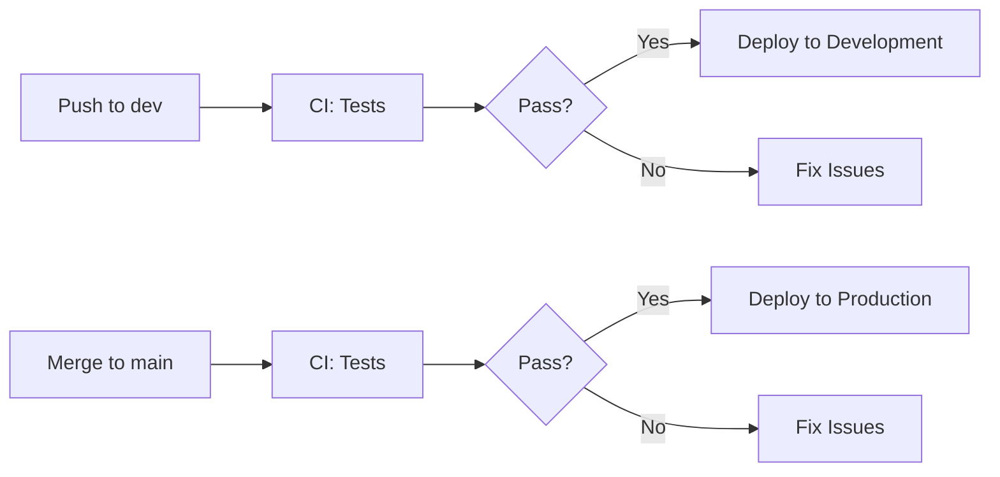

# Deployment

CI/CD pipeline and Railway deployment configuration.

## Overview



## Environments

| Environment | Branch | Trigger | URL |
|-------------|--------|---------|-----|
| Development | `dev` | Push | `*.dev.tekbreed.com` |
| Production | `main` | PR merge | `*.tekbreed.com` |

## CI Pipeline

Defined in `.github/workflows/ci.yml`:

1. **Quality** - Biome format and lint
2. **Unit Tests** - Vitest on changed packages
3. **E2E Tests** - Playwright (when enabled)

## Deploy Pipeline

Defined in `.github/workflows/deploy.yml`:

### Automatic Deployment

After CI passes:
- Detects changed apps using Turbo
- Deploys only changed apps in parallel
- Environment determined by branch

### Manual Deployment

Go to **Actions → Deploy → Run workflow**:
- Select app
- Select environment

## Railway Configuration

Each app has Railway service IDs stored as GitHub secrets:

```
RAILWAY_<APP>_DEV_SERVICE_ID
RAILWAY_<APP>_PROD_SERVICE_ID
RAILWAY_DEV_TOKEN
RAILWAY_PROD_TOKEN
```

## Adding a New App to Deployment

1. Create Railway services (dev + prod)
2. Add service ID secrets to GitHub:
   - `RAILWAY_<APPNAME>_DEV_SERVICE_ID`
   - `RAILWAY_<APPNAME>_PROD_SERVICE_ID`
3. Add app to `deploy.yml`:
   - `workflow_dispatch` options
   - `DEPLOYABLE_APPS` list
   - Service ID case statement

## Environment Variables

Set in Railway dashboard per service:
- Database credentials
- API keys
- Feature flags

See `apps/<app>/.env.example` for required variables.

## Monitoring

- Railway provides logs per service
- Check GitHub Actions for deployment status
